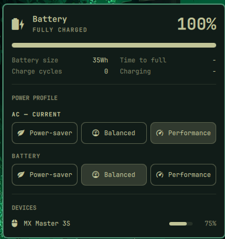

# omarchy-plugin-battery

A battery service and bar widget for the [Omarchy](https://omarchy.org/)
shell. The service is cloned from the built-in `omarchy.battery`
(low-battery warning, power-profile switching on plug/unplug); the bar
widget is cloned from `omarchy.power` (battery icon, hero, stats, power
profile picker), with a **DEVICES** section added.

## What it does

- Everything the native `omarchy.power` widget has: battery icon and
  percentage, charge/discharge status, battery size and cycle count,
  time left/to full, and the power profile picker.
- Below that picker, a compact "On AC" / "On battery" row lets you set
  the profile for **either** power source without having to unplug (or
  plug in) first — laptop-only, like the rest of this widget.
- Its popup adds a **DEVICES** section listing every other UPower
  device reporting a charge level — Bluetooth/USB mouse, keyboard,
  headset, game controller, etc. Each row has a mini charge meter and
  turns red at 10% and below, the same threshold/color every other
  Omarchy panel uses for an alert.
- The `omarchy.battery` low-battery notification and AC/battery power
  profile switching, running as a background service — extended to
  also warn when one of those other devices gets low, not just the
  laptop.

## Preview



## Usage

Click the battery icon in the bar to open the popup: the power profile
picker and the On AC/On battery row are right there, and the DEVICES
section lists any other charge-reporting peripheral below them.

## Install

```bash
omarchy plugin add https://github.com/vinicgobbi/omarchy-plugin-battery.git --enable
```

Disable the built-in `omarchy.battery` service and the `omarchy.power`
bar icon to avoid duplicate battery services/icons.

## Update

```bash
omarchy plugin update vinicgobbi.battery
```

## Uninstall

```bash
omarchy plugin remove vinicgobbi.battery
```

## Notes

- This plugin only makes sense on a laptop — the On AC/On battery
  picker and the low-battery warning both assume a system battery.
- Peripheral low-battery notifications are separate from the laptop's
  own low-battery warning, so a low mouse/keyboard doesn't trigger the
  laptop's `battery-low` hooks.

## Contributing

See [CONTRIBUTING.md](CONTRIBUTING.md) for local setup, the plugin's
file structure, and the commit/release process.

## License

[MIT](LICENSE)
